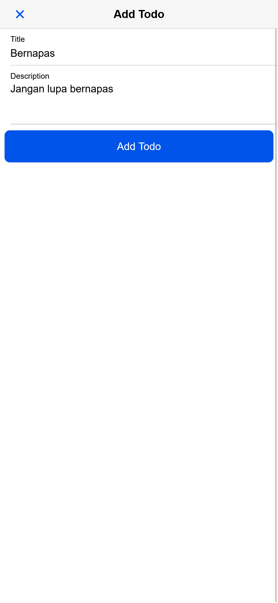
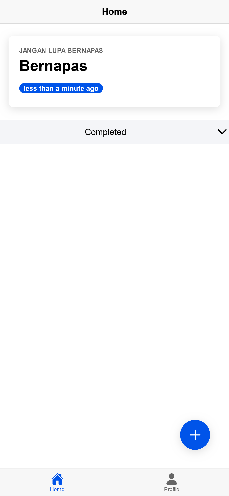
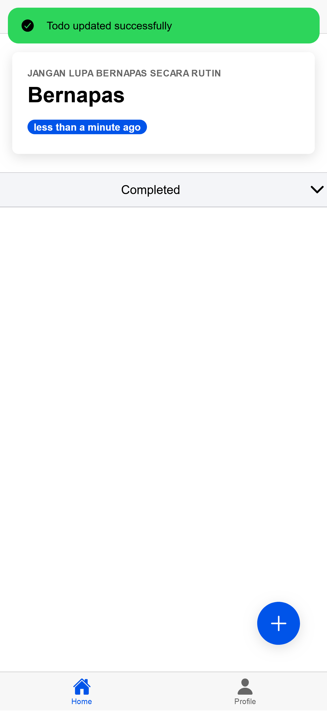
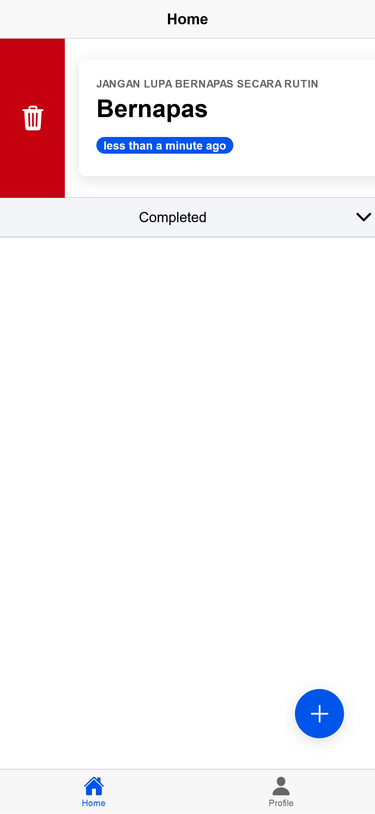
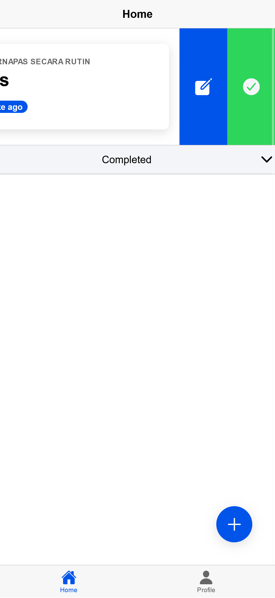

# Tugas 10 - Pertemuan 11

Imam Muzakki
H1D022060
Shift A -> D

## 1. Create Todo

Fitur menambahkan todo baru dengan input title dan description. Klik tombol "+" di pojok kanan bawah untuk membuka modal input. Setelah mengisi, tekan tombol "Add Todo" untuk menyimpan ke Firestore.

## 2. Read Todo

Daftar todo ditampilkan dengan dua section: Active Todos dan Completed Todos. Setiap todo menampilkan:
- Title
- Description
- Relative time (e.g., "2 hours ago")
- Status (active/completed)

## 3. Update Todo

Edit todo dengan cara:
- Geser todo ke kanan dan klik ikon pensil
- Modal edit akan terbuka dengan data todo yang dipilih
- Ubah title atau description
- Tekan tombol "Edit Todo" untuk menyimpan perubahan

## 4. Delete Todo

Menghapus todo dengan dua cara:
- Geser todo ke kiri dan klik ikon tempat sampah
- Konfirmasi penghapusan akan muncul
- Todo akan langsung dihapus dari Firestore

## 5. Toggle Todo Status

Ubah status todo:
- Geser todo ke kanan dan klik centang untuk mengubah status
- Todo akan berpindah antara Active dan Completed
- Status tersimpan di Firestore dengan timestamp update
